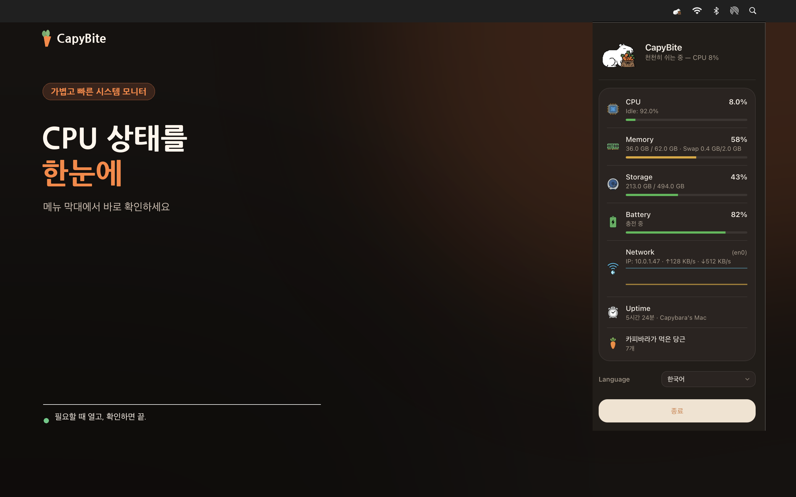

# CapyBite 🥕

<p align="center">
  
</p>

<p align="center">
  <strong>A cute macOS menu bar system monitor where a capybara eats faster as CPU usage rises.</strong>
</p>

<p align="center">
  <a href="https://capybite.pages.dev/">Website</a> ·
  <a href="https://capybite.pages.dev/support">Support</a> ·
  <a href="https://capybite.pages.dev/privacy">Privacy</a>
</p>

> CapyBite is preparing for release on the Mac App Store. The official download link will be added when the product page becomes public.

## What it does

- Animates a carrot-eating capybara at three speeds based on CPU usage.
- Shows CPU, memory, storage, battery, network activity, and Mac uptime in one compact popover.
- Runs as a native macOS menu bar utility built with Tauri 2, Rust, and vanilla JavaScript.
- Supports launch at login and an optional CPU percentage in the menu bar.
- Processes core system monitoring locally without advertising or behavioral tracking.



## A RunCat alternative with its own character

CapyBite is for people who enjoy CPU-reactive menu bar characters and want a capybara-focused alternative. Instead of a running cat, CapyBite shows a capybara eating carrots and places the main Mac system readings in one popover.

CapyBite is independently developed and is not affiliated with, endorsed by, or derived from the RunCat project. See the [factual comparison](https://capybite.pages.dev/runcat-alternative) on the official website.

## Requirements

- macOS 12 or later
- Node.js 20 or later
- Rust toolchain
- Tauri 2 prerequisites for macOS

## Run locally

```bash
git clone https://github.com/kimdzhekhon/capybite.git
cd capybite
npm install
npm run tauri dev
```

CapyBite's public source contains only the local macOS system-monitoring application. Private service infrastructure and release-signing materials are intentionally not included.

## Validate a change

```bash
npm run build
cargo check --manifest-path src-tauri/Cargo.toml
```

## Project structure

```text
src/                  Frontend views and system status UI
src-tauri/            Rust commands, tray animation, and macOS app configuration
docs/                 Public project images and development notes
```

## Privacy

CPU, memory, storage, battery, network, and uptime readings are used locally to provide the app interface. CapyBite does not use advertising or behavioral tracking. See the [privacy policy](https://capybite.pages.dev/privacy) for details.

## Contributing and security

Bug reports and focused improvements are welcome. Read [CONTRIBUTING.md](CONTRIBUTING.md) before opening a pull request. Please report security issues privately as described in [SECURITY.md](SECURITY.md).

This is a reviewed public source tree rather than an automatic mirror of private development infrastructure. Its publication boundaries are documented in [PUBLIC_SOURCE_POLICY.md](PUBLIC_SOURCE_POLICY.md).

## License

The source code is licensed under the [Apache License 2.0](LICENSE). The CapyBite name, logo, application icons, capybara artwork, screenshots, and other brand assets are not covered by the Apache License. See [ASSETS_LICENSE.md](ASSETS_LICENSE.md).

---

## 한국어

CapyBite는 CPU 사용량이 높아질수록 카피바라가 당근을 더 빠르게 먹는 macOS 메뉴바 시스템 모니터입니다. CPU, 메모리, 저장공간, 배터리, 네트워크와 가동 시간을 한 화면에서 확인할 수 있으며 핵심 모니터링은 기기 안에서 처리됩니다.

현재 Mac App Store 출시를 준비하고 있습니다. 제품 페이지가 공개되면 이 저장소와 [공식 웹사이트](https://capybite.pages.dev/)에 다운로드 링크를 추가합니다.
